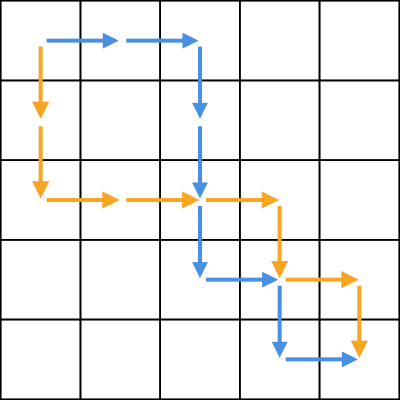

#   You Can Go Your Own Way: Analysis
##  Extra Files
* `problem.svg`: Picture in original problem
* `example.svg`: An example used below

##  My Approach
The most efficient way to not copy Lydia's footsteps is to anti-copy her footsteps, by walking a path that is reflective compared to Lydia's, like such:

In programming terms, replace all `S`'s with `E`'s, and all `E`'s with `S`'s

This path is guaranteed that you would not retrace Lydia's steps, as all steps are reflective of Lydia's
